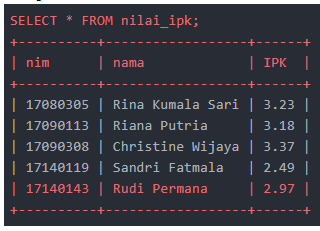
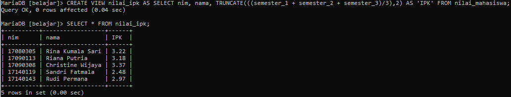
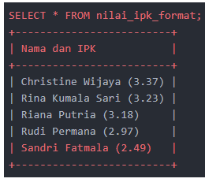
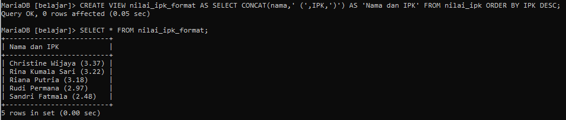
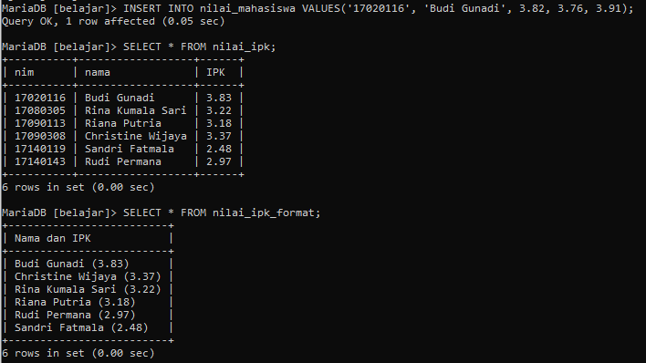
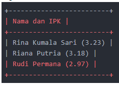
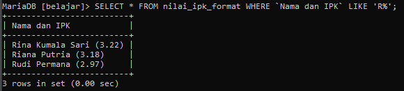
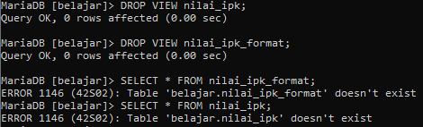

# Tugas_12_MySQL

### Sebagai tabel sample, silahkan buat tabel nilai_mahasiswa:
```mysql
DROP TABLE IF EXISTS nilai_mahasiswa;
```

```mysql
CREATE TABLE nilai_mahasiswa (
	nim CHAR(8) PRIMARY KEY,
	nama VARCHAR(50),
	semester_1 DECIMAL(4,2),
	semester_2 DECIMAL(4,2),
	semester_3 DECIMAL(4,2)
) ENGINE = InnoDB;
```

```mysql
INSERT INTO nilai_mahasiswa VALUES
('17090113', 'Riana Putria', 3.12, 2.98, 3.45),
('17140143', 'Rudi Permana', 2.56, 3.14, 3.22),
('17080305', 'Rina Kumala Sari', 3.45, 2.56, 3.67),
('17140119', 'Sandri Fatmala', 2.12, 2.78, 2.56),
('17090308', 'Christine Wijaya', 3.78, 3.23, 3.11);
```

### 1. Buat view nilai_ipk yang diambil dari tabel nilai_mahasiswa. View ini terdiri dari kolom nim, nama, dan IPK. Tampilan akhir view adalah sebagai berikut:


### (**Note:** Kolom IPK dalam kasus ini merupakan kolom komputasi, dimana nilainya akan dihitung dari kolom-kolom yang sudah ada. Kolom seperti ini sebaiknya tidak ikut disimpan ke dalam database, tapi cukup dihitung pada saat akan ditampilkan, atau disimpan ke dalam view).

```mysql
CREATE VIEW nilai_ipk AS 
SELECT nim, nama, TRUNCATE(((semester_1 + semester_2 + semester_3)/3),2) AS 'IPK' FROM nilai_mahasiswa;
```



### 2. Buat view kedua dengan nama nilai_ipk_format. Isi view ini diambil dari view nilai_ipk. Tampilan akhir view adalah sebagai berikut:


### Hasil diatas harus terurut dari IPK tertinggi ke terendah. (**Tips:** gunakan fungsi CONCAT() untuk menggabungkan string, serta query ORDER BY untuk pengurutan).

```mysql
CREATE VIEW nilai_ipk_format AS 
SELECT CONCAT(nama,' (',IPK,')') AS 'Nama dan IPK' FROM nilai_ipk 
ORDER BY IPK DESC;
```



### 3. Input 1 baris baru ke dalam tabel nilai_mahasiswa, kemudian periksa isi view nilai_ipk dan nilai_ipk_format. Data baru yang diinput boleh sembarang. Pastikan isi view juga langsung terupdate dengan penambahan data ini.
```mysql
INSERT INTO nilai_mahasiswa VALUES
('17020116', 'Budi Gunadi', 3.82, 3.76, 3.91)
```



### 4. Tampilkan mahasiswa yang namanya diawali dengan huruf R. Data ini diambil dari view nilai_ipk_format. Berikut tampilan akhir yang diiginkan:


```mysql
SELECT * FROM nilai_ipk_format WHERE `Nama dan IPK` LIKE 'R%';
```



### 5. Hapus view nilai_ipk dan nilai_ipk_format.
```mysql
DROP VIEW nilai_ipk;
```

```mysql
DROP VIEW nilai_ipk_format;
```


